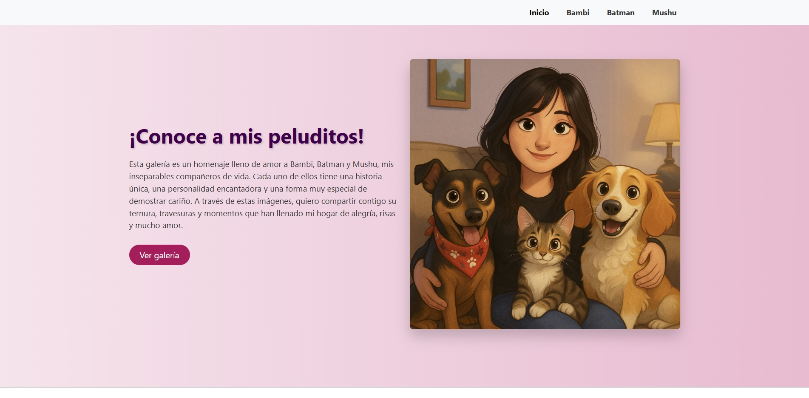

Este proyecto corresponde al trabajo realizado en el módulo 2 del bootcamp de desarrollo web. Consiste en una galería de imágenes sencilla y responsiva, desarrollada con HTML, CSS y JavaScript, que representa el aprendizaje de estructuras básicas de maquetación y diseño visual.

Objetivos del Proyecto
  -Aplicar conocimientos básicos de HTML, CSS, JavaScript.
  -Estructurar contenido visual mediante cajas (divs).
  -Usar propiedades de diseño para alinear, distribuir y personalizar elementos.
  -Crear una experiencia visual armónica y responsiva.

Tecnologías Utilizadas
  - HTML5
  - CSS3
  - JavaScript
  - JQuery

Vista previa del proyecto

  

Estructura del Proyecto
  Galeria_imageles_AE6_ABP/
    ├── index.html
    └── style.css
    
Cómo Ejecutar
    - Clona este repositorio: git clone https://github.com/CatalinaMonserrat/Galeria_imageles_AE6_ABP.git
    - Abre el archivo index.html en tu navegador.

Autor
Catalina Monserrat
Bootcamp Desarrollo Web con Python/Django
GitHub: @CatalinaMonserrat
